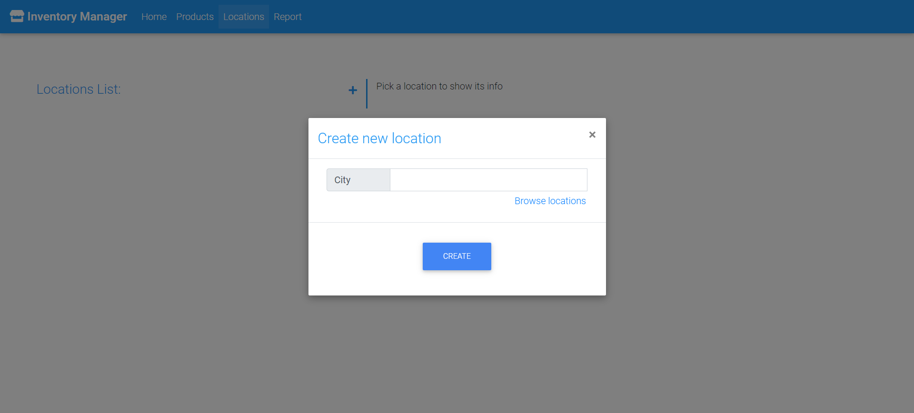

# Inventory Manager

A web application built with React and Flask, designed for inventory management. It allows users to manage product inventories in different warehouses efficiently.

# Functionality

- Perform CRUD operations (Create, Read, Update, Delete) on products, locations, and product movements.
- View detailed product balance reports per location.
- Data validation for user inputs, ensuring correct product quantities and locations.

# Used Technologies

- **Frontend:** ReactJs, Material Design for Bootstrap, HTML, CSS.
- **Backend:** Python (Flask).
- **Database:** MySQL.

# How to Run the Project

## Step 1: Clone the Repository

Open your terminal and run the following commands:

```bash
git clone https://github.com/ameentalahmeh/inventory-manager.git
cd inventory-manager
```

## Step 2: Set Up the Virtual Environment (For Flask Backend)

1. **Create a Virtual Environment:**
   
   ```bash
   python -m venv .venv
   ```

2. **Activate the Virtual Environment:**

   - On **Windows**:
  
     ```bash
     .\.venv\Scripts\activate
     ```
  
   - On **macOS/Linux**:
  
     ```bash
     source .venv/bin/activate
     ```

3. **Install Required Python Packages:**
   
   Ensure you're in the root directory (`inventory-manager`), then run:

   ```bash
   pip install -r server/requirements.txt
   ```

## Step 3: Set Up the MySQL Database

1. **Install MySQL** (if not already installed):
   
   - **Windows:** Download and install from [here](https://dev.mysql.com/downloads/installer/).
  
   - **macOS/Linux:** Use Homebrew or apt package managers:
  
     ```bash
     brew install mysql  # macOS

     sudo apt install mysql-server  # Ubuntu/Debian
     ```

2. **Start the MySQL Server:**

   - On **Windows**, start MySQL from the MySQL Workbench or through the services panel.
  
   - On **macOS/Linux**, start MySQL using the terminal:
  
     ```bash
     sudo service mysql start
     ```

3. **Load the Initial Database Schema:**

   - Navigate to the `server/database/data` folder where the `products_store_db.sql` file is located, and run the following command:
  
     ```bash
     mysql -u root products_store_db < server/database/data/products_store_db.sql
     ```

4. **Configure Flask to Use MySQL:**
   
   - In the `server` folder, there should be a `db.yaml` file that holds the db details.
  
   - Update the database connection details in the `db.yaml` file:
  
     ```
     mysql_host: 'localhost'
     mysql_user: 'root'
     mysql_password:
     mysql_database: 'products_store_db'
     ```

   Replace `username` and `password` with your MySQL credentials.

## Step 4: Running the Backend (Flask API)

1. Ensure you're still inside the virtual environment (`.venv`), and run the following command to start the Flask server:
   
   ```bash
   cd server
   python app.py
   ```
  
   Flask will start the server at `http://127.0.0.1:5000/`.

## Step 5: Set Up the Frontend (React)

1. Navigate to the `client` folder:

   ```bash
   cd client
   ```

2. Install all dependencies:

   ```bash
   npm install
   ```

3. Start the Client and Server concurrently:

   ```bash
   npm run dev
   ```

   The app will run at `http://localhost:3000` and access the flask app via proxy in `package.json` file.

---


# Screenshots

## Home View
- Home page:

  

## Product View
- Products page:

  

- Create product:

  

- Edit product:

  
  
 ## Location view
  - Locations page
  
  
  
  - Create location
  
  
  
  - Edit location
  
  
  
 ## Report view
  - Report page
  
  
  
 ## Validation
  - No enough products at location
  
  
  
  - No changes made
  
  
  
  - Required inputs are empty
  
  

  - Inputs with invalid formats
  
  
