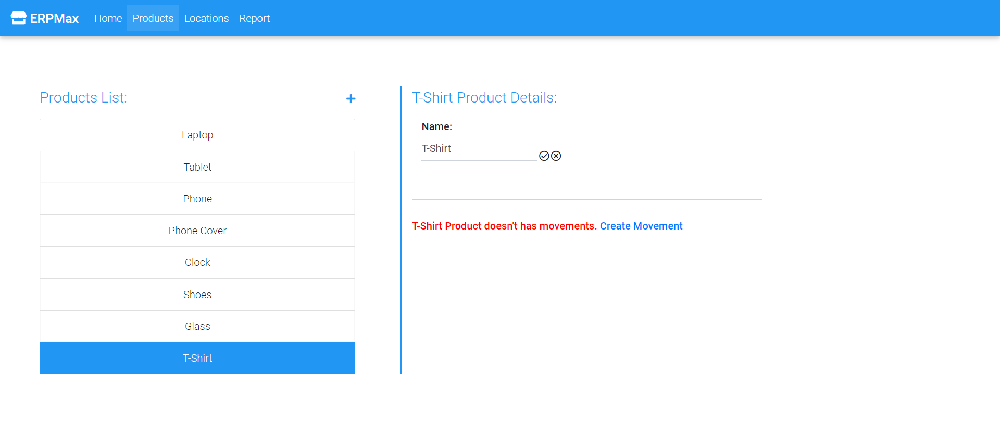

# Description
  A web app based on React and Flask, which is an inventory management application that enables the user to manage the inventory of a list of products in the respective warehouses. 

# Functionality
 - Get/ Create/ Edit products, locations, and products movements.
 - View product balance report for each location.
 - Request and data validation.
 
# Used Technologies
 - **Frontend:** ReactJs, Material Design for Bootstrap, HTML, CSS.
 - **Backend:** Python (Flask).
 - **DB:** MySQL.

# How to run project
 - Open your terminal.
 - Clone the project repo via `git clone https://github.com/ameentalahmeh/inventory-manager.git` command, then `cd inventory-manager`.
 - Create your MySQL database.
    - Note: You can use the pushed `products_store_db.sql` file to prepare your database tables.
 - Configure your database to connect with the Flask API through editing `yaml.db` file, and update enviroment variables with your database details.
 - Running the project:
    1. Go to `client` folder using `cd client` command.
    2. Install all used node modules via `npm install` command.
    3. Run the project using `npm run dev`.
  - Website is running, Enjoy :) 

# Screenshots
 ## Home view
  - Home page
  
  
  
 ## Product view
  - Products page
  
  
  
  - Create product
  
  
  
  - Edit product
  
  
  
  
  - Add movement
  
  
  
  - Edit movement
  
  
 
 ## Location view
  - Locations page
  
  
  
  - Create location
  
  
  
  - Edit location
  
  
  
 ## Report view
  - Report page
  
  
  
 ## Validation
  - No enough products at location
  
  
  
  - No changes made
  
  
  
  - Required inputs are empty
  
  

  - Inputs with invalid formats
  
  
  
  
